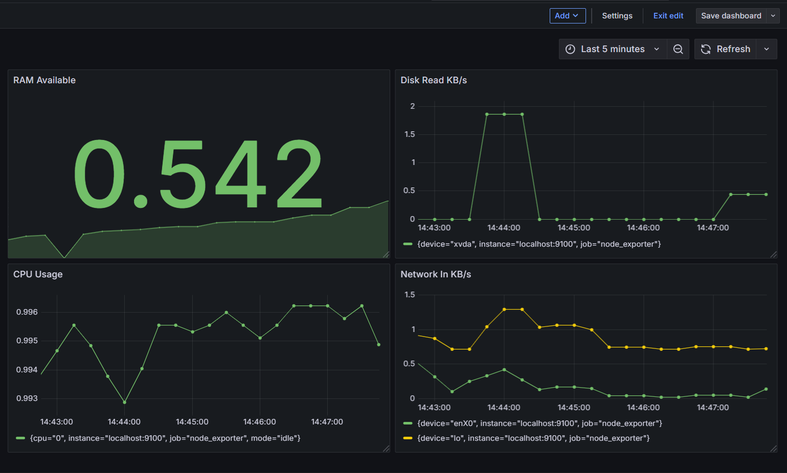

# EC2 Monitoring Dashboard 🖥️

A beginner-friendly monitoring setup for AWS EC2 instances using 
Prometheus, Node Exporter, and Grafana. This project visualizes 
real-time server metrics like CPU usage, RAM, Disk and Network 
on a live dashboard.
## Features ✨

- 📊 Real-time CPU usage monitoring
- 🧠 RAM availability tracking  
- 💾 Disk read speed monitoring
- 🌐 Network traffic monitoring
- 📈 Visual graphs and charts via Grafana
## Tech Stack 🛠️

- **Grafana** - Data visualization and dashboarding
- **Prometheus** - Metrics collection and storage
- **Node Exporter** - Exposes EC2 server metrics
- **AWS EC2** - Ubuntu 26.04 LTS server
## Screenshots 📸


## Installation 🚀

### Prerequisites
- AWS EC2 instance (Ubuntu 26.04 LTS)
- Port 9090, 9100, 3000 open in Security Group

### Step 1 - Install Node Exporter
```bash
wget https://github.com/prometheus/node_exporter/releases/download/v1.8.1/node_exporter-1.8.1.linux-amd64.tar.gz
tar xvf node_exporter-1.8.1.linux-amd64.tar.gz
sudo mv node_exporter-1.8.1.linux-amd64/node_exporter /usr/local/bin/
```

### Step 2 - Install Prometheus
```bash
wget https://github.com/prometheus/prometheus/releases/download/v2.51.0/prometheus-2.51.0.linux-amd64.tar.gz
tar xvf prometheus-2.51.0.linux-amd64.tar.gz
sudo mv prometheus-2.51.0.linux-amd64/prometheus /usr/local/bin/
```

### Step 3 - Install Grafana
```bash
sudo apt-get install -y adduser libfontconfig1 musl
wget https://dl.grafana.com/oss/release/grafana_11.6.1_amd64.deb
sudo dpkg -i grafana_11.6.1_amd64.deb
sudo systemctl enable grafana-server
sudo systemctl start grafana-server
```
## Run Locally 🖥️

### Start all services
```bash
sudo systemctl start node_exporter
sudo systemctl start prometheus
sudo systemctl start grafana-server
```

### Access Grafana Dashboard
http://YOUR_EC2_IP:3000

### Default Login
**Username:** admin
**Password:** admin

### Verify Prometheus is collecting data
http://YOUR_EC2_IP:9090
